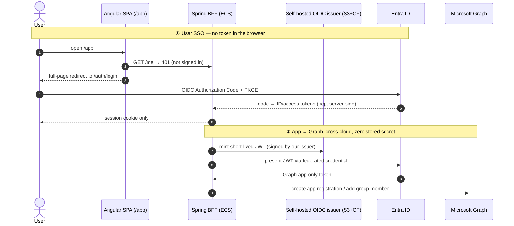
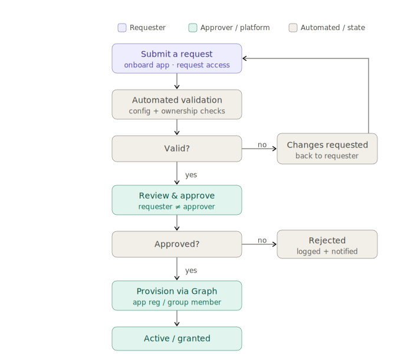

# Enterprise Onboarding Platform

A cross-cloud **self-service portal for onboarding internal applications to SSO and governing
access** — an **AWS-hosted** app that authenticates users against **Microsoft Entra ID** and provisions
into **Microsoft Graph across clouds with zero stored credentials**.

> **▶ Live demo:** https://d3919zy3gh57yu.cloudfront.net/app — sign in with Microsoft. *(Use the `/app`
> link directly — the bare root is a legacy status page.)* **Need an account?** Sign-in is real Entra SSO
> with role-based access — **[contact the maintainer (@dsl2022)](docs/USER-GUIDE.md#getting-a-demo-account)
> to be provisioned a demo (or Super Admin) account.**
>
> **📖 [Application User Guide](docs/USER-GUIDE.md)** — every feature explained + seven step-by-step
> demo/testing scenarios.
>
> **Delivery board:** https://github.com/users/dsl2022/projects/9 · **Deep dives:**
> [PROJECT_BRIEF_V0.md](PROJECT_BRIEF_V0.md) · [DECISIONS.md](DECISIONS.md) (ADRs) ·
> [RUNBOOK.md](RUNBOOK.md) · [API contract](docs/api/openapi-v1.yaml) · [RBAC matrix](docs/api/rbac-matrix.md)

---

## What it does

Large orgs onboard internal apps to SSO and grant downstream access through slow, ticket-driven,
error-prone manual work. This platform makes it **self-service and auditable**:

- **App onboarding** — register an internal app; on approval it provisions a **real Entra app
  registration** (returns the client ID).
- **Access requests** — browse a catalog and request access; on approval it adds a **real Entra group
  membership**; *My Access* shows what you hold and lets you request removal.
- **Teams, a unified review queue, and a tamper-evident audit trail** tie it together.
- **Role-aware throughout** — what you can see and do is driven by your identity, and the **server is
  always authoritative** (the UI only hides what you can't do).

## Architecture

AWS hosts the app; Azure is the identity plane. The defining constraint: **no long-lived cloud
credential exists anywhere** — every trust boundary is short-lived federation.



## How the cross-cloud auth works (the zero-credential story)

Two trust flows, neither holding a static secret. **Flow ①** keeps user tokens server-side (the browser
only ever has a session cookie). **Flow ②** lets the AWS app call Microsoft Graph by minting a token
against its *own* OIDC issuer and federating it at Entra — **no client secret is ever stored or rotated.**



## Request lifecycle

Onboarding and access share **one request engine and state machine**; provisioning is **asynchronous**
(a worker drives the `PROVISIONING` transitions via a transactional outbox, with retry/backoff).
**Separation of duties** is enforced — the requester can never be the approver.



## Engineering highlights

- **Zero stored credentials** — GitHub→AWS and GitHub→Azure run on OIDC federation; the app calls Graph
  via **Workload Identity Federation**. Nothing to leak, nothing to rotate.
- **Contract-first** — a frozen OpenAPI spec is the source of truth; the typed frontend client is
  regenerated in CI and the build **fails on any drift**.
- **Authorization done properly** — roles come from the Entra **app-roles** claim; permissions are the
  **union** of all held roles; **ABAC ownership** and **separation of duties** are enforced on the *real*
  principal — even under **impersonation** (capabilities reduce to the impersonated role while identity
  and the audit trail stay the real user).
- **Resilient async provisioning** — a shared engine with a guarded state machine, a **transactional
  outbox**, an idempotent worker, a reaper with exponential backoff, and a projection that is the source
  of truth for "currently held."
- **Operable by construction** — every change ships **PR → Terraform plan (posted to the PR) →
  environment-approved apply**; infra is fully reproducible and **destroys cleanly**. Covered by unit,
  Testcontainers (Postgres/Redis), architecture-boundary (ArchUnit), and contract tests.

## Tech stack

| Layer | Choice |
|---|---|
| Frontend | Angular 18 SPA (typed client generated from the OpenAPI contract) |
| Backend | Java 21, Spring Boot 3 — BFF pattern (session-cookie auth, no browser tokens) |
| Data | RDS PostgreSQL, Redis (sessions), Flyway migrations |
| Cloud / runtime | AWS ECS Fargate, ALB, CloudFront, S3 |
| Identity | Microsoft Entra ID (SSO + app-roles), Microsoft Graph |
| IaC / CI-CD | Terraform via GitHub Actions, OIDC federation (no stored keys) |

## Status & roadmap

**Done — and verified live against real Azure:**

- ✅ Frozen API contract · ✅ Data layer (Postgres + Redis) · ✅ AuthZ engine (RBAC / ABAC / SoD / impersonation)
- ✅ App onboarding **+ real Entra app-registration provisioning**
- ✅ Access requests / My Access / removal **+ real Entra group-membership provisioning** · ✅ Teams
- ✅ Unified review queue · ✅ **Tamper-evident audit** (hash-chained, single-writer, `/verify`) · ✅ In-app notifications

The full UI is live to click today — see the **[Application User Guide](docs/USER-GUIDE.md)** for a
feature-by-feature tour and demo walkthroughs.

**Next:** assistant wizard (currently a `501` stub) · high-availability (≥2 tasks, pre-provisioned issuer
key) · blue/green deploys · security hardening. All scoped on the
[delivery board](https://github.com/users/dsl2022/projects/9); see also [docs/V1-PLAN.md](docs/V1-PLAN.md).

## How it's built & governed

- **Multi-agent delivery** with an architect review gate on every PR.
- **Decisions are durable** — architecture decisions as ADRs ([DECISIONS.md](DECISIONS.md)) and
  reviewer-raised, rationale-carrying change requests ([docs/change-requests/](docs/change-requests/)).
- **Repo guide:**
  - `app/` — Spring Boot, by module: `auth` · `wif` · `graph` · `request` (engine) · `authz` ·
    `onboarding` · `access` · `teams` (ArchUnit enforces the boundaries)
  - `frontend/` — Angular SPA + generated contract client
  - `deploy/terraform/` — root module + `envs/` + `modules/` (network, data, cache, edge, service, entra, webapp…)
  - `.github/workflows/` — `ci` · `infra` (plan/apply) · `app-deploy` · `frontend-deploy`
  - `docs/` — [Application User Guide](docs/USER-GUIDE.md), frozen [OpenAPI](docs/api/openapi-v1.yaml),
    [RBAC matrix](docs/api/rbac-matrix.md), [V1 plan](docs/V1-PLAN.md), change requests

## Running it

CI is authoritative (all Terraform runs in GitHub Actions, never locally). For a quick local backend:

```bash
docker build -t eop-app .
docker run --rm -p 8080:8080 eop-app
curl localhost:8080/healthz
```

Frontend dev (proxies `/api` + `/auth` to `:8080`, with a dev mock identity so the shell is browsable
without standing up Entra):

```bash
cd frontend && npm ci && npm start   # http://localhost:4200
```

See [RUNBOOK.md](RUNBOOK.md) for one-time bootstrap, admin consent, key rotation, and teardown.
